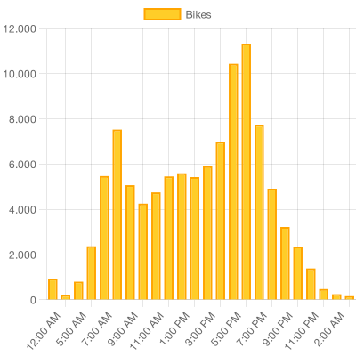

# TidyJS - Analise de dados com Javascript

Aplicação para analise de dados com JS. [Veja o post para saber mais.](https://prensa.li/@tuliocalil/javascript-para-dados-data-analytics-com-js)

<div align="center">



</div>

## Como rodar

Clone o projeto e instale as dependencias.

No seu terminal execute:

```bash
npm run generate
```

<div align="center">

### Made with 💙 in Bahia, Brasil.

</div>
